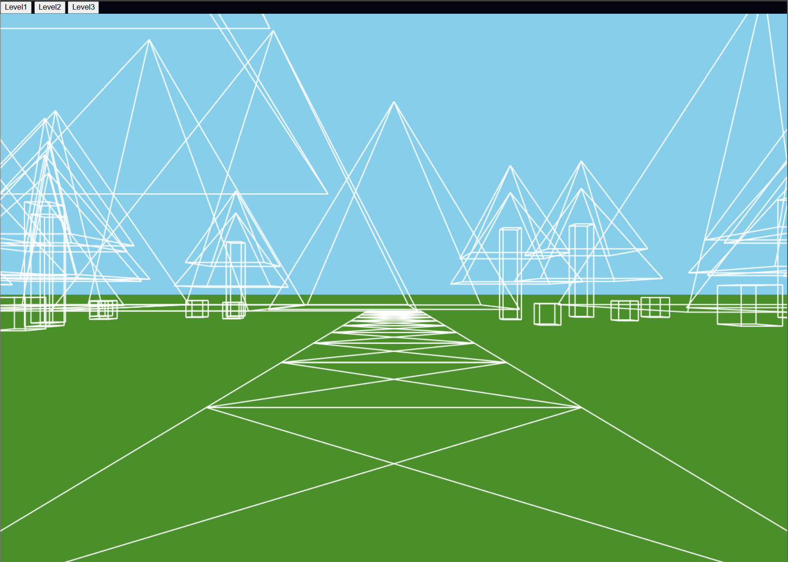
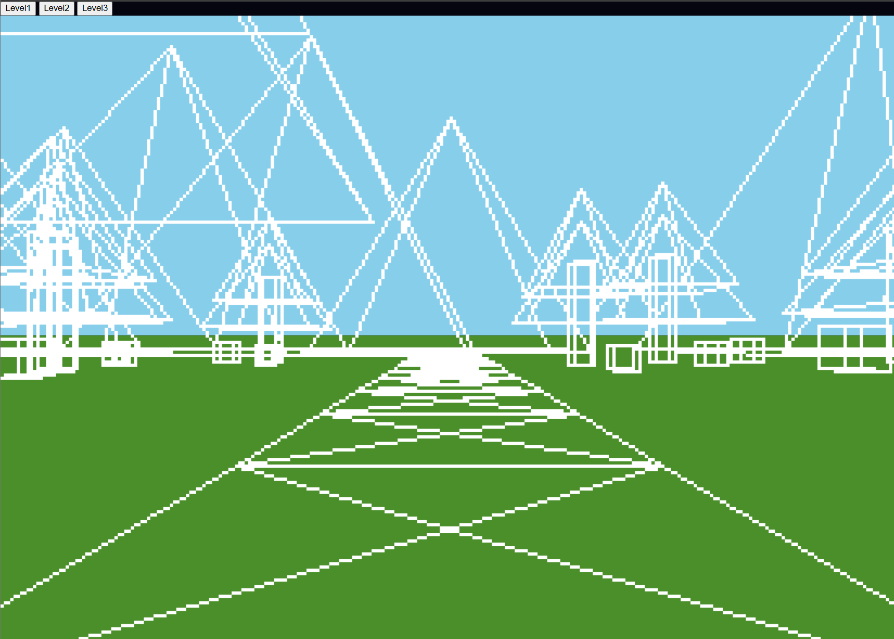
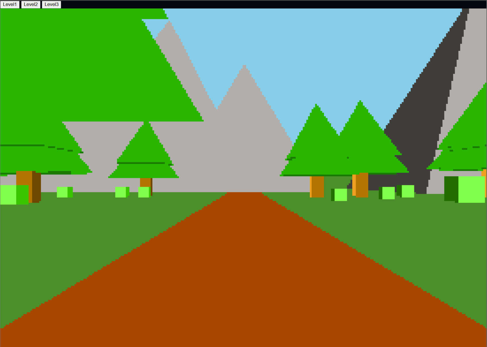
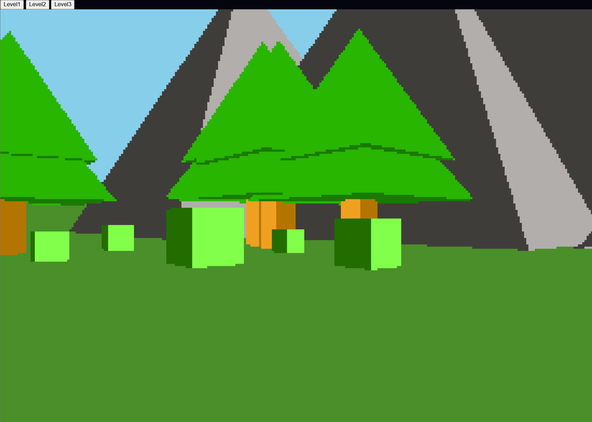
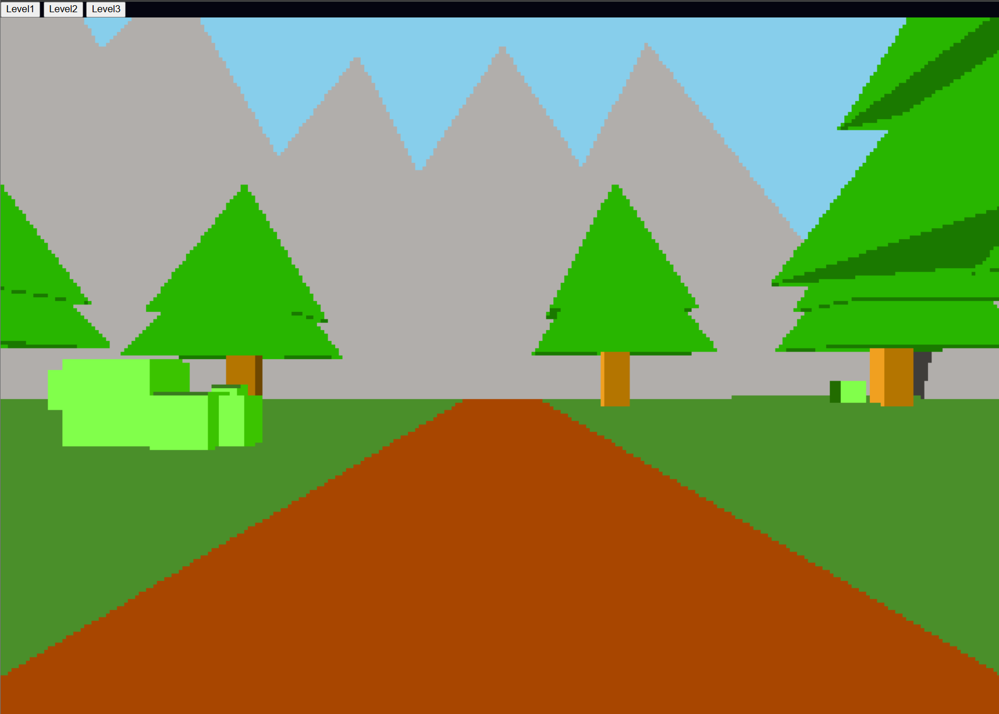

# Project 1: Pinhole Camera, Rasterized Display

**Name: Jaxon Polo**
**Course: Computer Graphics I 5160**

A 3d landscape you can walk through, drawn with the HTML canvas. The same level can be seen in three different levels:

1. **Wireframe:** lines drawn with the canvas's built in line function
2. **Low-res wireframe** my own line drawing on a mock 320x200 pixel screen
3. **Filled triangles** solid, colored surfaces with depth sorting on the 320x200 screen

---

## Design

You can stand on a dirt path in a forest valley surrounded by mountains, and you can walk and look around freely.

The scene uses five object types: path tiles, tree trunks, tree tops, bushes, and mountains. Trees and bushes are placed randomly on both sides of the path with random sizes. Large mountains sit in  the distance to form the horizon.

---

## Controles

| Input | Action |
|---|---|
| Level 1 / 2 / 3 buttons | Switch levels |
| W / S | Move forward / backward |
| A / D | Move left / right |
| <- / -> | Turn left / right |
| R | Reset with a new random scene |

---

## Screenshots

| Level 1 | Level 2 | Level 3 |
|---|---|---|
|  |  |  |

## How it works

### 3d Models
Each object is defined once, centered on the origin, as a list of vertices, edges used in Levels 1 and 2 and triangles in Level 3.

### Instances
Each object in the world is an instance with a position, a scale, and a rotation. To place them each is scaled and then translated to the instance's position.

### Movement
The camera stays in one spot and the world moves around it instead. Walking shifts every object and turning rotates every object around the camera. On screen this looks the same as moving the camera.

### Pinhole Camera
Each point's x and y are divided by its z so father objects appear smaller. The result is then scaled and centered on the canvas.

### Objects Behind the Camera
Points behind the camera can't be projected, so everything ins clipped at a near plane just in front of the it. If the line crosses that plane it cuts where it crosses and only the visible part is drawn.

### Level 1: Wireframe
Every edge is projected and drawn with the `lineTo()` function at full resolution.

### Level 2: Low-res Lines
A 2d array stands in for a 320x200 screen. Lines are drawn into it with Bresenham's line algorithm, which steps one pixel at a time toward the end point. Each filled cell is then drawn as large square on the canvas.

### Level 3: Filled Triangles
For each triangle, every pixel in its bounding box it tested with edge functions to see whether it is inside the triangle. A depth buffer stores the closest depth found so far for each pixel. A pixel only get colored if the triangle is closer than what is already there so nearby objects hide farther ones.

--- 

## Future Work

- Add collision so you can't walk through objects
- Add lighting based coloring of all faces so each is distinct from one another
- Make the movement more smooth
- Draw levels 1 and 2 in color so each is more readable

---

## AI Usage

I used Claude as a learning support tool and to help finds ways that Level 3 could be optimized in order for it to run smoothly.

**What I used AI for:**
- **Understanding the concepts:** asking questions about pinhole camera projection, near-plane clipping, Bresenham's line algorithm, edge functions, barycentric coordinates and depth buffering, so I understood how to implement them.
- **Optimization:** getting suggestions to make my existing code run faster and more cleanly.
- **Cleanup and documentation:** formatting the code, adding explanatory comments, and drafting this README, which I then reviewed and edited.

**What I did myself:**
- The project idea, scene design and object models
- Writing the rendering pipeline and all three levels
- Deciding which suggestions to use, and testing every change

